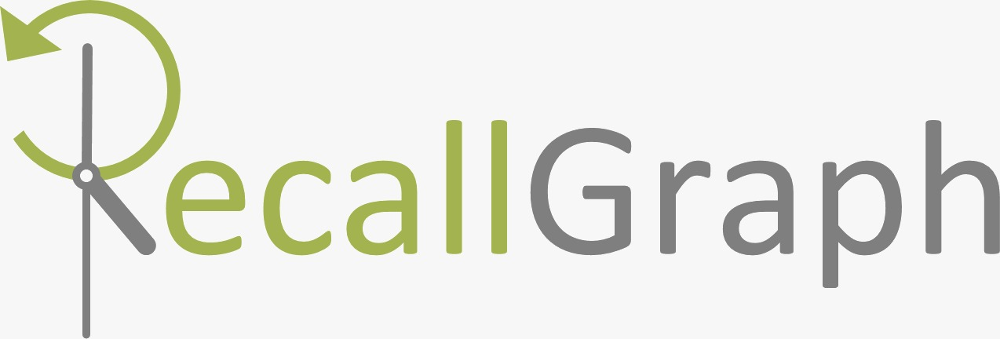

# RecallGraph - A versioning data store for time-variant graph data.
RecallGraph is a _versioned-graph_ data store - it retains all changes that its data (vertices and edges) have gone through to reach their current state. It supports _point-in-time_ graph traversals, letting the user query any past state of the graph just as easily as the present.

It is a [Foxx Microservice](https://www.arangodb.com/why-arangodb/foxx/) for [ArangoDB](https://www.arangodb.com/) that features _VCS-like_ semantics in many parts of its interface, and is backed by a transactional event tracker. It is currently being developed and tested on ArangoDB v3.5, with support for v3.6 in the pipeline.

---

---

## Important!
While the software has demonstrated ample stability under test conditions, it is still under active development, and subject to potentially breaking changes from time to time. The latest tagged version may be used in lightweight, non-critical production deployments, i.e., systems which do not impact primary business functions if they face downtime or data loss/corruption. Note that there are **no battle-hardened, stable releases yet**.

### Disclaimer
The authors and maintainers of RecallGraph are not liable for damages or indemnity (express or implied) for loss of any kind incurred directly or indirectly as a result of using this software.

## Do I Need a 'Versioned Graph' Database?
To get an idea of where such a data store might be used, see:

1. [The Case for Versioned Graph Databases](https://adityamukho.com/the-case-for-versioned-graph-databases/),
1. [Illustrative Problems in Dynamic Network Analysis](https://en.wikipedia.org/wiki/Dynamic_network_analysis#Illustrative_problems_that_people_in_the_DNA_area_work_on)

Also check out the recording below (RecallGraph Presented @ ArangoDB Online Meetup)

**TL;DR:** RecallGraph is a potential fit for scenarios where data is best represented as a network of vertices and edges (i.e., a graph) having the following characteristics:
1. Both vertices and edges can hold properties in the form of attribute/value pairs (equivalent to JSON objects).
1. Documents (vertices/edges) mutate within their lifespan (both in their individual attributes/values and in their relations with each other).
1. Past states of documents are as important as their present, necessitating retention and queryability of their change history.

## Salient API Features
RecallGraph's API is split into 3 top-level categories:

### Document
- **Create** - Create single/multiple documents (vertices/edges).
- **Replace** - Replace entire single/multiple documents with new content.
- **Delete** - Delete single/multiple documents.
- **Update** - Add/Update specific fields in single/multiple documents.
- **(Planned) Explicit Commits** - Commit a document's changes separately, after it has been written to DB via other means (AQL / Core REST API / Client).
- **(Planned) CQRS/ES Operation Mode** - Async implicit commits.

### Event
- **Log** - Fetch a log of events (commits) for a given path pattern (path determines scope of documents to pick). The log can be optionally grouped/sorted/sliced within a specified time interval.
- **Diff** - Fetch a list of forward or reverse commands (diffs) between commits for specified documents.
- **(Planned) Branch/Tag** - Create parallel versions of history, branching off from a specific event point of the main timeline. Also, tag specific points in branch+time for convenient future reference.
- **(Planned) Materialization** - Point-in-time checkouts.

### History
- **Show** - Fetch a set of documents, optionally grouped/sorted/sliced, that match a given path pattern, at a given point in time.
- **Filter** - In addition to a path pattern like in **'Show'**, apply an expression-based, simple/compound post-filter on the retrieved documents.
- **Traverse** - A point-in-time traversal (walk) of a past version of the graph, with the option to apply additional post-filters to the result.

## Installation
RecallGraph installs like any other _Foxx Microservice_ inside a database on an ArangoDB instance.

1. Download the [latest release](https://github.com/RecallGraph/RecallGraph/releases).
2. Follow the instructions in the [Foxx Deployment Manual](https://www.arangodb.com/docs/3.5/foxx-deployment.html). The web interface is the easiest, while the `foxx-cli` is more suitable for power users.

**Note:** A _one-click_ cloud deployment option might be made available in the future for those who wish to take RecallGraph for a test ride without having to set up a server from scratch.

## Docs
- Quick-reference API documentation is available directly in the Swagger console (accessed through ArangoDB's web UI).
- Detailed API docs, tutorials and technical docs are being worked on, and will be available soon.

## Limitations
1. Although the test cases are quite extensive and have good coverage, this service has only been tested on single-instance DB deployments, and **not on clusters**.
2. As of version 3.5, ArangoDB does not support ACID transactions for multi-document/collection writes in [cluster mode](https://www.arangodb.com/docs/3.5/transactions-limitations.html#in-clusters). Transactional ACIDity is not guaranteed for such deployments.

## Development Roadmap
1. Support for absolute/relative revision-based queries on individual documents (in addition to the timestamp-based queries supported currently),
1. Branching/tag support,
1. Support for the _valid time_ dimension in addition to the currently implemented _transaction time_ dimension (https://www.researchgate.net/publication/221212735_A_Taxonomy_of_Time_in_Databases),
1. Support for ArangoDB v3.6,
1. Multiple, simultaneous materialized checkouts (a la `git`) of selectable sections of the database (entire DB, named graph, named collection, document list, document pattern), with eventual branch-level specificity,
1. CQRS/ES operation mode (async implicit commits),
1. Explicit commits,
1. Support for ArangoDB clusters (limited at present by lack of support for multi-document ACID transactions in clusters).
1. Multiple authentication and authorization mechanisms.

## Get in Touch
- Raise an issue or PR on this repo, or
- Mail me (email link in Github profile), or
- Join the Gitter channel - [https://gitter.im/RecallGraph/community](https://gitter.im/RecallGraph/community).
